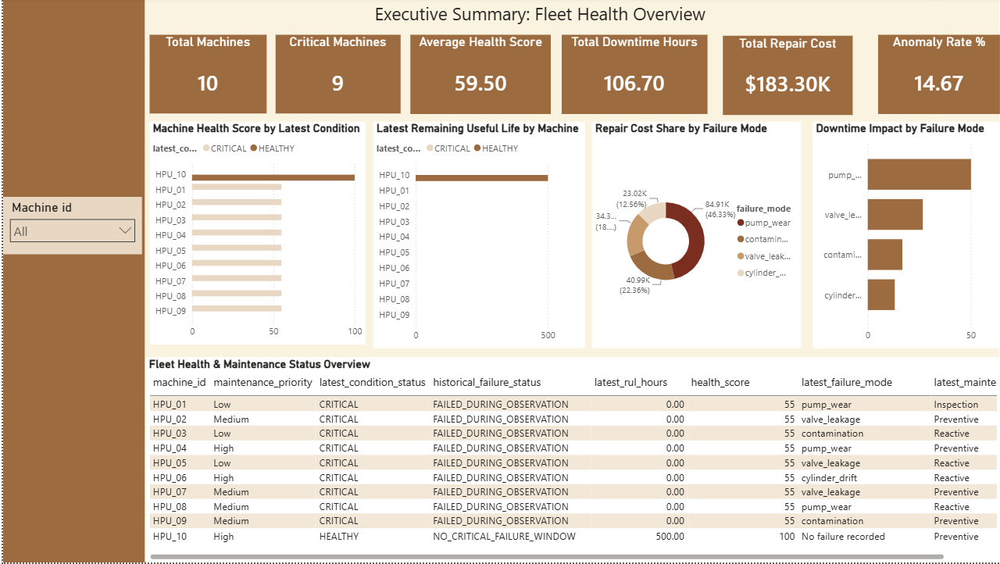
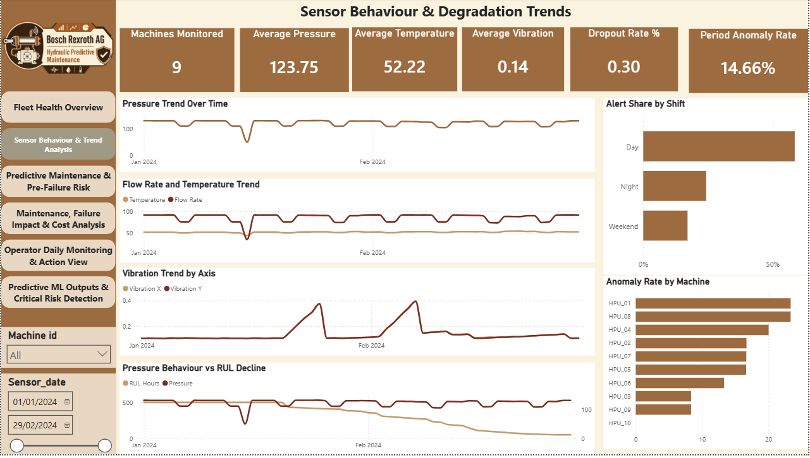
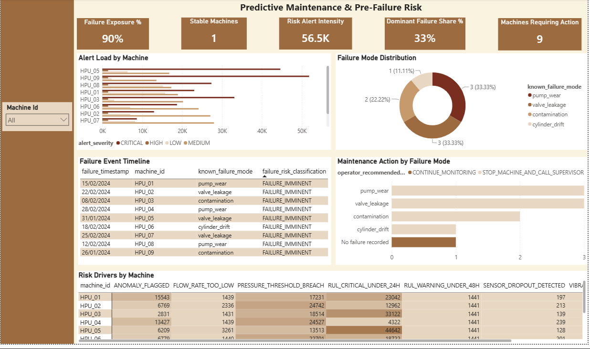
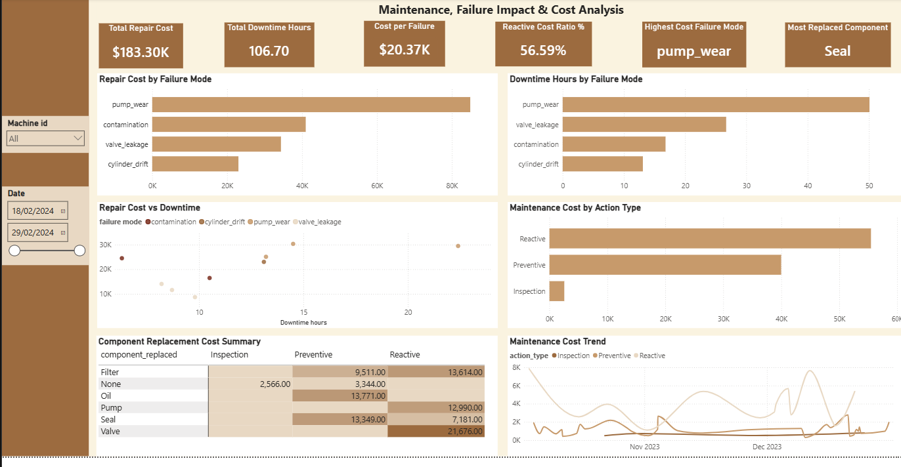
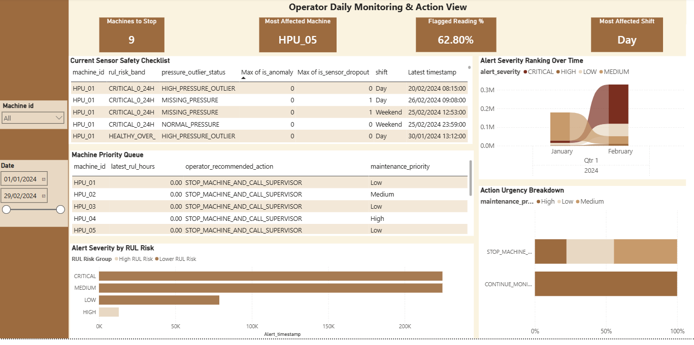
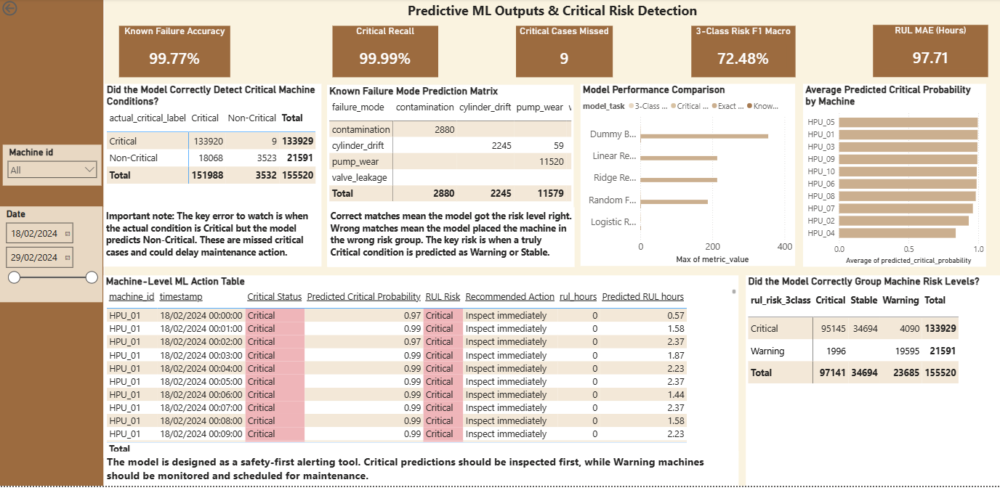

# Hydraulic Predictive Maintenance System

An end-to-end predictive maintenance project for hydraulic systems, combining PostgreSQL, Python machine learning, Power BI, MLflow, GitHub Actions, and Streamlit.

The project simulates how Bosch Rexroth AG could use sensor telemetry and machine learning to move from reactive maintenance to predictive and condition-based maintenance.

---

## Company Context

Bosch Rexroth AG is a global leader in drive and control technologies, specialising in industrial hydraulics, electric drives, automation, and motion control systems. The company supplies critical hydraulic components such as pumps, valves, cylinders, linear motion systems, and automation technologies used across manufacturing, construction, energy, mobility, and heavy machinery.

Hydraulic systems are central to continuous industrial production. When these systems fail unexpectedly, the impact can include production stoppages, emergency repair costs, delayed customer deliveries, and inefficient maintenance scheduling.

This project is built around a realistic industrial scenario where sensor-enabled hydraulic systems generate large volumes of time-series data, but that data needs to be transformed into actionable maintenance intelligence.

---

## Business Problem

Bosch Rexroth AG operates in a demanding industrial environment where hydraulic systems run under high pressure, variable temperatures, vibration, flow instability, contamination risk, and near-continuous production cycles.

The current maintenance approach is largely reactive. Failures are often discovered after degradation has already reached a critical point, resulting in:

- Unplanned downtime
- Costly emergency repairs
- Delayed production and customer delivery
- Inefficient technician allocation
- Poor spare parts planning
- Limited visibility into early failure signals

Although sensors capture important machine behaviour such as pressure, temperature, flow rate, vibration, RPM, anomaly flags, and dropout indicators, this data is often underused in operational decision-making.

The core business challenge is therefore:

> How can sensor data, failure history, and maintenance logs be used to predict hydraulic failure risk earlier, estimate Remaining Useful Life, classify failure modes, and support proactive maintenance decisions?

---

## Purpose of the Project

The purpose of this project is to build a predictive maintenance system that uses historical and time-series sensor data to:

- Predict machine failure risk
- Classify hydraulic failure modes
- Estimate Remaining Useful Life (RUL)
- Identify machines requiring urgent maintenance
- Support maintenance engineers with interpretable dashboards and recommended actions

The project supports a shift from reactive maintenance to predictive and condition-based maintenance.

---

## Expected Business Outcomes

The expected outcomes are:

- Earlier detection of potential machine failures
- Reduction in unplanned downtime
- Improved maintenance planning and technician workload management
- Better spare parts planning
- Lower emergency repair costs
- Improved decision-making through dashboards and machine-level predictions
- Stronger transition toward data-driven industrial maintenance

---

## Key Project Objectives

The project was structured around seven main objectives.

### 1. Data Ingestion and Integration

Sensor telemetry, equipment metadata, failure labels, and maintenance logs were integrated into PostgreSQL.

Main tables:

- `sensor_telemetry`
- `equipment_master`
- `failure_labels`
- `maintenance_log`

The raw telemetry table contained **864,000 sensor readings** across 10 hydraulic units.

### 2. Data Validation and Quality Assessment

Data quality checks were performed in SQL and Python, including:

- Missing value checks
- Duplicate record checks
- Machine ID consistency checks
- Timestamp conversion and validation
- Sensor dropout analysis
- Invalid numeric range checks
- Operational outlier detection
- Failure timeline validation

Key findings:

- Total sensor telemetry rows: **864,000**
- Missing sensor rows: **2,590**
- Sensor dropout rate: **0.30%**
- No duplicate machine-timestamp records detected
- No invalid failure chronology detected
- Operational outliers were retained because extreme sensor behaviour may represent early failure signals

### 3. Feature Engineering and Time-Series Transformation

Python was used to create time-series features from raw sensor data, including:

- Vibration magnitude
- Rolling mean features
- Rolling standard deviation features
- Lag features
- Change/difference features
- RUL risk bands
- Critical vs non-critical labels
- Failure mode targets

The model was trained on engineered features derived from:

- Pressure
- Temperature
- Flow rate
- Vibration X/Y
- Pump RPM
- Anomaly indicators
- Sensor dropout indicators
- Shift and day-of-week patterns

### 4. Advanced Analysis and Pattern Discovery

Exploratory analysis was performed to understand:

- Sensor behaviour by machine
- Pressure and RUL decline
- Vibration changes before failure
- Failure mode distribution
- Alert intensity by machine
- Maintenance action patterns
- Repair cost and downtime impact
- Sensor anomaly behaviour

Power BI was then used to convert these findings into interactive dashboards.

### 5. Machine Learning for Failure Classification and RUL Prediction

Multiple supervised machine learning tasks were developed:

- Known failure mode classification
- Exact RUL regression
- 3-class RUL risk classification
- Critical vs non-critical classification

Models tested included:

- Logistic Regression
- Random Forest
- Ridge Regression
- Linear Regression
- Dummy Baseline models
- XGBoost was considered during model experimentation

### 6. Model Deployment, Monitoring, and Visualisation

The project includes:

- Power BI dashboard pages for business users
- Streamlit decision-support app for machine-level review
- Exported prediction outputs for dashboard integration
- Final decision-rule layer to convert raw ML outputs into practical maintenance actions

The Streamlit app allows a maintenance user to:

- Select a machine
- View final critical status
- View final RUL risk
- View raw critical model score
- Review recommended maintenance action
- Inspect prediction records
- Review risk distribution
- Review selected-machine prediction quality
- View overall model performance

### 7. MLOps, Automation, and Reproducibility

The project includes MLOps and reproducibility components:

- MLflow experiment tracking
- Joblib model export
- Saved model artifacts
- GitHub Actions CI workflow
- Pytest validation checks
- Reusable Streamlit deployment structure

---

## Dataset Overview

The project uses four main data sources.

### `sensor_telemetry`

Contains time-series sensor readings.

Main fields:

- `timestamp`
- `machine_id`
- `pressure_bar`
- `temp_celsius`
- `flow_lpm`
- `vibration_x_g`
- `vibration_y_g`
- `pump_rpm`
- `is_anomaly`
- `failure_mode`
- `rul_hours`
- `is_sensor_dropout`
- `shift`
- `day_of_week`

### `equipment_master`

Contains machine-level metadata.

Main fields:

- `machine_id`
- `installation_date`
- `total_operating_hours`
- `fluid_type`
- `last_filter_change_date`
- `maintenance_priority`

### `failure_labels`

Contains known failure events.

Main fields:

- `failure_event_id`
- `machine_id`
- `failure_timestamp`
- `failure_mode`
- `degradation_start_timestamp`
- `repair_cost_usd`
- `downtime_hours`

### `maintenance_log`

Contains maintenance records.

Main fields:

- `maintenance_id`
- `machine_id`
- `action_timestamp`
- `action_type`
- `component_replaced`
- `technician_id`
- `cost_usd`

---

## SQL Workflow

PostgreSQL was used for data storage, cleaning, validation, exploratory analysis, and creation of reporting views.

Main SQL tasks included:

- Table creation
- Data type conversion
- Timestamp cleaning
- Missing value checks
- Duplicate checks
- Machine consistency checks
- Sensor dropout analysis
- Operational outlier detection
- Failure timeline validation
- Business KPI view creation
- Power BI reporting view creation

Example SQL quality checks included:

```sql
SELECT
    machine_id,
    COUNT(*) AS total_readings,
    SUM(is_sensor_dropout) AS dropout_count,
    ROUND(100.0 * SUM(is_sensor_dropout) / COUNT(*), 2) AS dropout_rate_pct
FROM sensor_telemetry
GROUP BY machine_id
ORDER BY dropout_rate_pct DESC;
```

A clean telemetry view was created to support EDA and Power BI reporting:

```sql
CREATE OR REPLACE VIEW sensor_telemetry_clean AS
SELECT *
FROM sensor_telemetry
WHERE pressure_bar IS NOT NULL
  AND temp_celsius IS NOT NULL
  AND flow_lpm IS NOT NULL
  AND vibration_x_g IS NOT NULL
  AND vibration_y_g IS NOT NULL
  AND pump_rpm IS NOT NULL;
```

Operational outliers were flagged rather than removed because extreme pressure, vibration, or flow behaviour may represent meaningful pre-failure signals.

---

## Python Machine Learning Pipeline

The Python pipeline was developed in Jupyter/Colab and includes:

- Data loading from exported CSV files
- Data inspection
- Timestamp conversion
- Missing value handling
- Target engineering
- Feature engineering
- Time-based train/test splitting
- Preprocessing pipeline
- Model training
- Model evaluation
- MLflow experiment tracking
- Export of predictions for Power BI and Streamlit
- Joblib model artifact export

Main Python libraries used:

- Pandas
- NumPy
- Scikit-learn
- XGBoost
- Matplotlib
- Seaborn
- MLflow
- Joblib

---

## Feature Engineering

The following features were created:

- `vibration_magnitude`
- Rolling mean over recent readings
- Rolling standard deviation over recent readings
- Lag features
- Sensor change features
- RUL status labels
- 3-class RUL risk labels
- Critical binary target

The RUL risk logic was simplified into three business-friendly classes:

```text
Critical = 0-24 hours
Warning = 25-499 hours
Stable = 500 hours
```

This rule was used in the final Streamlit decision layer because it is clearer for maintenance decision-making.

---

## Machine Learning Results

### Known Failure Mode Classification

This model predicts known hydraulic failure modes such as:

- Pump wear
- Valve leakage
- Contamination
- Cylinder drift

Best result:

- Model: Logistic Regression
- Accuracy: **99.77%**

This model performed strongly on labelled known failure records.

### Exact RUL Regression

This model estimates remaining useful life as a numeric value.

Best result:

- Model: Random Forest
- MAE: **97.71 hours**
- RMSE: **186.97 hours**
- R²: **-0.53**

The RUL regression model was useful as a baseline, but exact RUL prediction remained challenging because the dataset contains many capped stable values and many zero-RUL failure states.

### 3-Class RUL Risk Classification

This model classifies machine condition into:

- Stable
- Warning
- Critical

Best result:

- Model: Random Forest
- Accuracy: **76.09%**
- F1 Weighted: **79.36%**
- F1 Macro: **72.48%**

This model was more practical for dashboard use than exact RUL regression.

### Critical vs Non-Critical Classification

This model focuses on the most important operational question:

> Is the machine in a critical condition or not?

Best result:

- Model: Logistic Regression
- Critical Recall: **99.99%**
- Critical cases missed: **9**

This model was treated as a safety-first alerting model because missing critical failures is more dangerous than raising extra warnings.

However, raw model output sometimes over-flagged healthy machines. A final RUL-based decision layer was therefore added for dashboard action logic.

---

## Final Decision Logic

The Streamlit app uses a final business decision rule based on machine-level RUL:

```text
0-24 hours = Critical
25-499 hours = Warning
500 hours = Stable
```

Final action mapping:

```text
Critical = Inspect immediately
Warning = Monitor and schedule maintenance
Stable = Continue monitoring
```

This makes the app easier for maintenance engineers to interpret.

The raw critical model score is still shown, but it is treated as supporting evidence rather than the final decision.

---

## Power BI Dashboard

The Power BI dashboard contains six report pages.

### Page 1: Executive Summary - Fleet Health Overview

Purpose:

- Show overall fleet health, failure exposure, repair cost, downtime, and machine status.

Key KPIs:

- Total Machines: **10**
- Critical Machines: **9**
- Average Health Score: **59.50**
- Total Downtime Hours: **106.70**
- Total Repair Cost: **$183.30K**
- Anomaly Rate: **14.67%**

Main visuals:

- Machine Health Score by Latest Condition
- Latest Remaining Useful Life by Machine
- Repair Cost Share by Failure Mode
- Downtime Impact by Failure Mode
- Fleet Health & Maintenance Status Overview

  

### Page 2: Sensor Behaviour & Degradation Trends

Purpose:

- Monitor sensor trends, anomaly behaviour, dropout rate, and degradation patterns.

Key KPIs:

- Machines Monitored: **9**
- Average Pressure: **123.75**
- Average Temperature: **52.22**
- Average Vibration: **0.14**
- Dropout Rate: **0.30%**
- Period Anomaly Rate: **14.66%**

Main visuals:

- Pressure Trend Over Time
- Flow Rate and Temperature Trend
- Vibration Trend by Axis
- Pressure Behaviour vs RUL Decline
- Alert Share by Shift
- Anomaly Rate by Machine

  

### Page 3: Predictive Maintenance & Pre-Failure Risk

Purpose:

- Identify machines showing pre-failure behaviour and understand risk drivers.

Key KPIs:

- Failure Exposure: **90%**
- Stable Machines: **1**
- Risk Alert Intensity: **56.5K**
- Dominant Failure Share: **33%**
- Machines Requiring Action: **9**

Main visuals:

- Alert Load by Machine
- Failure Mode Distribution
- Failure Event Timeline
- Maintenance Action by Failure Mode
- Risk Drivers by Machine



### Page 4: Maintenance, Failure Impact & Cost Analysis

Purpose:

- Quantify the financial and operational impact of failures and maintenance actions.

Key KPIs:

- Total Repair Cost: **$183.30K**
- Total Downtime Hours: **106.70**
- Cost per Failure: **$20.37K**
- Reactive Cost Ratio: **56.59%**
- Highest Cost Failure Mode: **pump_wear**
- Most Replaced Component: **Seal**

Main visuals:

- Repair Cost by Failure Mode
- Downtime Hours by Failure Mode
- Repair Cost vs Downtime
- Maintenance Cost by Action Type
- Component Replacement Cost Summary
- Maintenance Cost Trend



### Page 5: Operator Daily Monitoring & Action View

Purpose:

- Provide an operational daily view for frontline monitoring and action prioritisation.

Key KPIs:

- Machines to Stop: **9**
- Most Affected Machine: **HPU_05**
- Flagged Reading: **62.80%**
- Most Affected Shift: **Day**

Main visuals:

- Current Sensor Safety Checklist
- Machine Priority Queue
- Alert Severity by RUL Risk
- Alert Severity Ranking Over Time
- Action Urgency Breakdown



### Page 6: Predictive ML Outputs & Critical Risk Detection

Purpose:

- Show machine learning predictions, model performance, critical alert detection, and ML-supported maintenance decisions.

Key KPIs:

- Known Failure Accuracy: **99.77%**
- Critical Recall: **99.99%**
- Critical Cases Missed: **9**
- 3-Class Risk F1 Macro: **72.48%**
- RUL MAE: **97.71 hours**

Main visuals:

- Critical Detection Confusion Matrix
- Known Failure Mode Prediction Matrix
- Model Performance Comparison
- Average Predicted Critical Probability by Machine
- Machine-Level ML Action Table
- RUL Risk Grouping Matrix



---

## Streamlit App

The Streamlit app provides a lightweight interactive interface for maintenance engineers.

It includes:

- Machine selector
- Final critical status
- Final RUL risk
- Raw critical model score
- Recommended action
- Machine prediction records
- Predicted risk distribution
- Selected machine prediction quality
- Overall model performance summary

The app uses:

```text
data/ml_predictions_for_powerbi_corrected.csv
data/combined_model_performance_results.csv
```

---

## How to Run the Streamlit App Locally

Install the required dependencies:

```bash
pip install -r requirements.txt
```

Run the app:

```bash
streamlit run app.py
```

---

## MLflow Experiment Tracking

MLflow was used to track final model performance results.

Tracked information included:

- Model task
- Model name
- Accuracy
- Precision
- Recall
- F1 score
- MAE
- RMSE
- R²
- ROC AUC
- Critical recall

A SQLite MLflow backend was used:

```python
mlflow.set_tracking_uri("sqlite:///mlflow.db")
mlflow.set_experiment("Bosch Hydraulic Predictive Maintenance")
```

This supports reproducibility and experiment comparison.

---

## Model Artifacts

The best models and encoders were exported using Joblib.

Saved artifacts include:

- `best_known_failure_mode_classifier.pkl`
- `known_failure_mode_encoder.pkl`
- `best_rul_regression_model.pkl`
- `best_rul_risk_3class_classifier.pkl`
- `rul_risk_3class_encoder.pkl`
- `best_critical_binary_classifier.pkl`

These files support future reuse and deployment.

---

## CI/CD and Testing

A GitHub Actions workflow was added to validate the project.

The CI workflow checks:

- Python setup
- Dependency installation
- Streamlit app syntax
- Project structure tests

Local pytest checks passed successfully:

```text
4 passed
```

This provides basic automated validation before deployment.

---

## Project Structure

```text
hydraulic-predictive-maintenance/
│
├── app.py
├── requirements.txt
├── README.md
│
├── data/
│   ├── ml_predictions_for_powerbi_corrected.csv
│   └── combined_model_performance_results.csv
│
├── notebooks/
│   └── predictive_maintenance_ml_pipeline.ipynb
│
├── models/
│   ├── best_known_failure_mode_classifier.pkl
│   ├── known_failure_mode_encoder.pkl
│   ├── best_rul_regression_model.pkl
│   ├── best_rul_risk_3class_classifier.pkl
│   ├── rul_risk_3class_encoder.pkl
│   └── best_critical_binary_classifier.pkl
│
├── powerbi/
│   ├── dashboard.pbix
│   └── dashboard_screenshots/
│
├── sql/
│   ├── create_tables.sql
│   ├── data_quality_checks.sql
│   ├── exploratory_analysis.sql
│   └── reporting_views.sql
│
├── tests/
│   └── test_project_structure.py
│
└── .github/
    └── workflows/
        └── ci.yml
```

---

## Key Business Insights

The analysis showed:

- 9 out of 10 machines were exposed to failure risk.
- HPU_10 was the only stable machine.
- Pump wear was the highest-cost failure mode.
- Reactive maintenance accounted for **56.59%** of maintenance cost.
- Total repair cost reached **$183.30K**.
- Total downtime reached **106.70 hours**.
- Sensor dropout was low at **0.30%**, supporting good telemetry reliability.
- Period anomaly rate was approximately **14.66%-14.67%**.
- Critical recall reached **99.99%**, with only **9 critical cases missed**.
- Exact RUL regression remained challenging, with best MAE of **97.71 hours**.
- 3-class risk classification provided a more practical dashboard-ready output than exact RUL regression alone.

---

## Business Recommendations

Recommended actions include:

- Prioritise machines with Critical RUL risk for immediate inspection.
- Use Warning machines for planned maintenance scheduling.
- Monitor HPU_10 as the current stable benchmark.
- Investigate pump wear as a major cost and downtime driver.
- Reduce reliance on reactive maintenance by increasing preventive interventions.
- Use alert severity and risk-driver heatmaps to understand why each machine is being flagged.
- Improve RUL regression in future iterations using additional degradation-cycle features and longer historical data.

---

## Limitations

This project is a portfolio-grade predictive maintenance prototype.

Current limitations include:

- The dataset is structured/synthetic for project demonstration.
- Exact RUL regression performance is not yet production-grade.
- The Streamlit app is a prototype decision-support interface.
- The deployment does not yet connect to live PLC, MES, OPC-UA, or CMMS systems.
- Model monitoring and automated retraining are designed conceptually but not fully productionised.

---

## Future Improvements

Future work could include:

- Live sensor ingestion from OPC-UA or MQTT
- Cloud data lake integration
- Automated retraining pipeline
- Drift detection
- CMMS integration for maintenance ticket creation
- More advanced time-series models
- Improved RUL modelling with sequence-based models
- Streamlit Cloud deployment
- Power BI Service publishing
- Docker containerisation

---

## Final Summary

This project demonstrates a complete predictive maintenance workflow for hydraulic systems.

It covers:

- SQL data modelling and validation
- Python feature engineering
- Machine learning model training and evaluation
- MLflow experiment tracking
- Power BI dashboard development
- Streamlit app deployment structure
- GitHub Actions CI validation
- Business-focused interpretation of machine health and maintenance risk

The project shows how industrial sensor data can be converted into actionable maintenance intelligence to support earlier failure detection, reduced downtime, and better operational decision-making.

Commit changes
